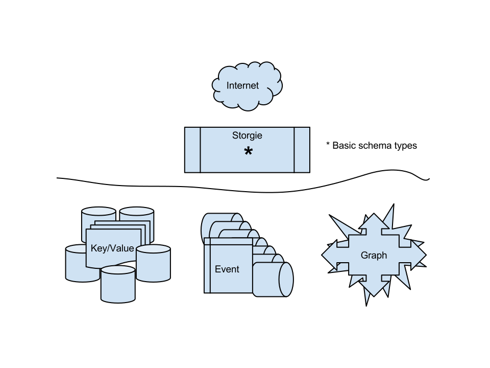
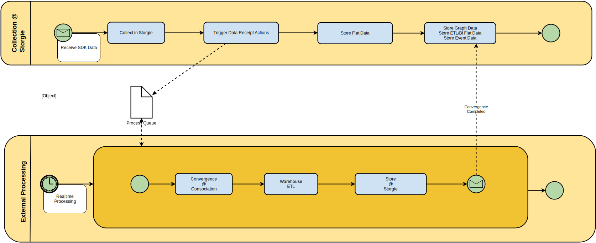

At a high level the Deconstructed Platform sits across a multi-region, multi-tier architecture that is setup to auto-scale compute, storage and other resources as needed.

---

</img>

</img>

</img>