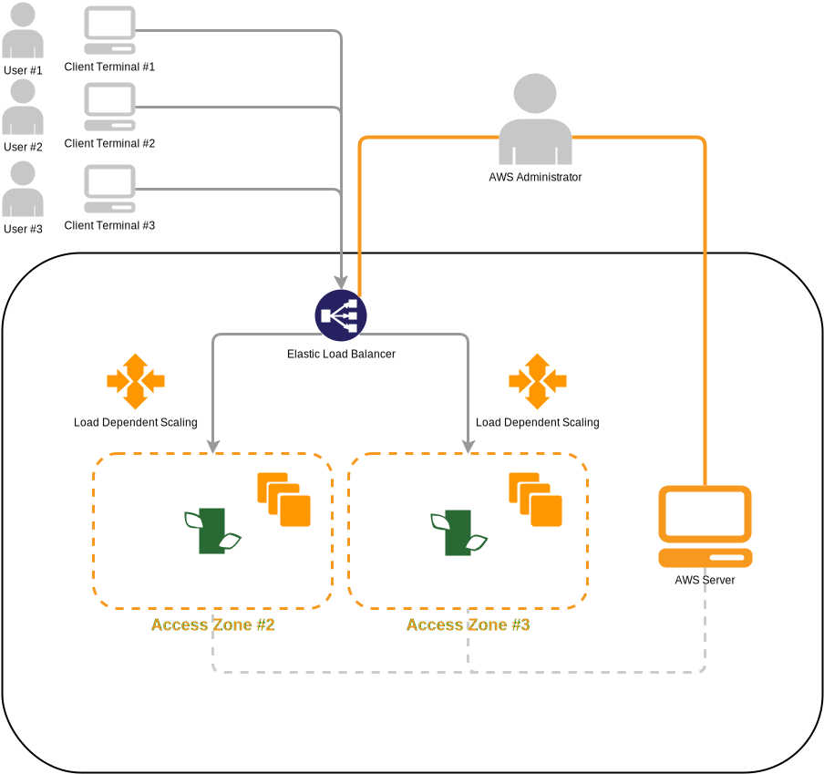

At a high level the Deconstructed Platform sits across a multi-region, multi-tier architecture that is setup to auto-scale compute, storage and other resources as needed. On the back end the platform uses a comobination of storage mechanisms that are also distributed, storing key value, graph and event series data. Currently these are the key storage types that provide the [consociation](/articles/consociation/) [(definition of consociation)](http://www.merriam-webster.com/dictionary/consociation).

---

</img>

</img>

</img>